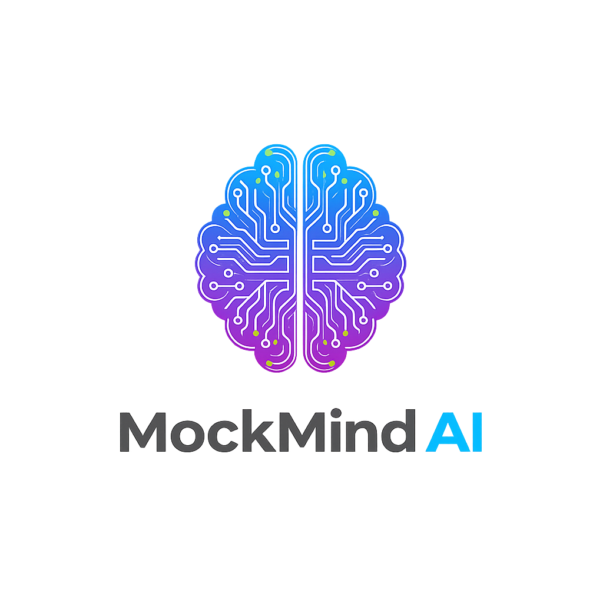

# MockMind AI

A fully local, voice-to-voice AI interview simulator powered by Ollama. Practice technical and behavioral interviews with a **realistic 3D AI interviewer** that runs entirely on your machine - no cloud APIs, no costs.

**Created by:** Yuvraj Purbia



## ✨ Features

- 🎤 **Voice-to-Voice**: Speak your answers naturally, hear questions read aloud with premium TTS
- 🎭 **3D AI Interviewer**: Realistic 3D avatar with advanced lip-sync and natural animations
- 🤖 **Local AI**: Powered by Ollama (llama3.2:3b) - runs 100% offline
- 📊 **Real-time Evaluation**: Get instant feedback on your answers with AI-powered scoring
- 📈 **Comprehensive Reports**: Detailed performance analysis with scores and recommendations
- 💰 **Zero Cost**: No API fees, no subscriptions, completely free
- 🔒 **Privacy First**: All data stays on your machine
- 🎨 **Premium UI**: Stunning dark robotic theme with 3D effects and smooth animations

## 📋 Prerequisites

- Node.js 18+ installed
- 8GB+ RAM (16GB recommended)
- Ollama installed with llama3.2:3b model
- Modern browser (Chrome/Edge recommended for best speech recognition)

## 🚀 Quick Start

### 1. Install Ollama

Download and install Ollama from [https://ollama.ai](https://ollama.ai)

```bash
# Pull the recommended model
ollama pull llama3.2:3b

# Verify Ollama is running
ollama list
```

### 2. Install Dependencies

```bash
# Install backend dependencies
cd server
npm install

# Install frontend dependencies
cd ../client
npm install
```

### 3. Configure Environment

**Backend (.env):**
```bash
cd server
cp .env.example .env
# Edit if needed (defaults work for most cases)
```

**Frontend (.env):**
```bash
cd client
# Create .env file
echo "VITE_API_BASE_URL=http://localhost:5000" > .env
```

### 4. Start the Application

**Terminal 1 - Backend:**
```bash
cd server
npm run dev
```
Server starts on http://localhost:5000

**Terminal 2 - Frontend:**
```bash
cd client
npm run dev
```
App starts on http://localhost:5173 (or 5174 if 5173 is in use)

### 5. Open in Browser

Navigate to the local URL shown in Terminal 2 (e.g., http://localhost:5173)

**Try the 3D Demo:** Click "Try 3D AI Interviewer Demo" on the home page or visit `/demo`

## 🎯 Usage

1. **Enter your information** (name and current company)
2. **Select your role** (Software Engineer, Product Manager, Designer, Data Scientist)
3. **Choose experience level** (Junior, Mid-level, Senior, Lead, Principal)
4. **Pick topics** to focus on (1-5 topics)
5. **Start the interview** and interact with the 3D AI interviewer
6. **Speak your answers** using your microphone
7. **Receive instant feedback** with scores and suggestions
8. **Review comprehensive report** at the end

## 🌐 API Endpoints

### Interview Management
- `POST /api/interviews/start` - Start a new interview session
  - Body: `{ userName, currentCompany, role, level, topics }`
  - Returns: `{ sessionId, firstQuestion }`

- `POST /api/interviews/:sessionId/answer` - Submit an answer
  - Body: `{ answer, audioMetadata }`
  - Returns: `{ evaluation, nextQuestion, shouldContinue }`

- `POST /api/interviews/:sessionId/end` - End interview
  - Returns: `{ reportId }`

- `GET /api/reports/:reportId` - Get final report
  - Returns: Full interview report with scores and feedback

### Health Checks
- `GET /api/health/ollama` - Check Ollama connection status
- `GET /health` - Server health check

## 📁 Project Structure

```
mockmind-ai/
├── client/                      # React frontend
│   ├── public/
│   │   └── logo.png            # MockMind AI logo
│   ├── src/
│   │   ├── components/
│   │   │   ├── interview/      # Interview-related components
│   │   │   ├── layout/         # Header, Footer
│   │   │   └── ui/             # Reusable UI components
│   │   ├── hooks/              # Custom React hooks
│   │   ├── pages/              # Page components
│   │   ├── services/           # API client
│   │   └── index.css           # Global styles
│   ├── tailwind.config.js      # Tailwind configuration
│   └── package.json
│
├── server/                      # Node.js backend
│   ├── src/
│   │   ├── config/             # Configuration & prompts
│   │   ├── controllers/        # Route handlers
│   │   ├── routes/             # API route definitions
│   │   ├── services/           # Business logic
│   │   └── server.js           # Express entry point
│   ├── data/sessions/          # Persisted sessions
│   └── package.json
│
├── CONTEXT.md                   # Development context & progress
├── README.md                    # This file
└── .gitignore
```

## 🛠️ Tech Stack

### Frontend
- **React 18** - UI framework
- **Vite** - Build tool & dev server
- **Tailwind CSS v3** - Utility-first CSS
- **Framer Motion** - Animations
- **React Three Fiber** - 3D rendering
- **@react-three/drei** - 3D helpers
- **Three.js** - WebGL 3D library
- **Web Speech API** - Voice input/output
- **Axios** - HTTP client

### Backend
- **Node.js + Express** - Server framework
- **Ollama** - Local LLM server
- **llama3.2:3b** - Language model
- **Winston** - Logging
- **Joi** - Request validation
- **CORS** - Cross-origin support

## 📊 Development Status

- [x] **Phase 1: Backend Foundation** ✅ Complete
  - REST API with all endpoints
  - Ollama integration
  - Session management
  - Prompt engineering

- [x] **Phase 2: Premium Frontend UI** ✅ Complete
  - React + Vite setup
  - Custom dark robotic theme
  - 4-step progressive setup wizard
  - 3D effects and animations

- [x] **Phase 3: Voice Integration with 3D Avatar** ✅ Complete
  - Enhanced text-to-speech with premium voices
  - Speech recognition with Web Speech API
  - True 3D AI interviewer with React Three Fiber
  - Advanced lip-sync synchronized with audio
  - Natural animations (blinking, breathing, head movements)
  - Interactive demo page

- [ ] **Phase 4: Full Interview Flow Integration** 🚧 Next
  - Complete backend integration
  - Real-time question generation
  - Answer evaluation flow
  - User context throughout session

- [ ] **Phase 5: Report Generation & Display** 📅 Planned
  - Comprehensive report page
  - Data visualizations
  - Performance charts
  - Export functionality

- [ ] **Phase 6: Polish, Testing & Optimization** 📅 Planned
  - Error handling
  - Performance optimization
  - Cross-browser testing
  - Production-ready quality

See [CONTEXT.md](./CONTEXT.md) for detailed progress and implementation notes.

## 🎮 Demo

Visit `/demo` route to experience the 3D AI interviewer without starting a full interview:
- Switch between 3 interviewer personalities
- Watch realistic lip-sync animations
- See real-time audio visualization
- Test voice quality and clarity

## 🐛 Troubleshooting

### Ollama Not Connecting
```bash
# Check if Ollama is running
ollama list

# Restart Ollama service
# On macOS/Linux: restart the Ollama app
# On Windows: restart Ollama from system tray
```

### Speech Recognition Not Working
- Ensure you're using Chrome or Edge (recommended)
- Check microphone permissions in browser settings
- Firefox and Safari have limited speech recognition support

### Port Already in Use
```bash
# Backend (default: 5000)
# Edit server/.env and change PORT

# Frontend (default: 5173)
# Vite will automatically try the next port (5174, 5175, etc.)
```

### Low Performance / Lag
- Ensure you have at least 8GB RAM available
- Close other memory-intensive applications
- Consider using llama3.2:3b (smaller, faster) instead of larger models

## 📝 License

MIT License - Feel free to use this project for learning and development.

## 🙏 Credits

**Created with ❤️ by Yuvraj Purbia**

**Powered by:**
- [Ollama](https://ollama.ai) - Local LLM runtime
- [React Three Fiber](https://docs.pmnd.rs/react-three-fiber) - 3D rendering
- [Tailwind CSS](https://tailwindcss.com) - Styling
- [Framer Motion](https://www.framer.com/motion/) - Animations

---

**Note:** This is a local-first application designed for privacy and zero cost. No data is sent to external servers.
